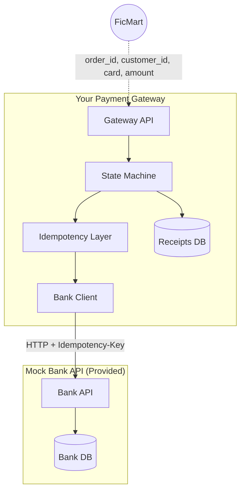

# Payment Gateway

Part of the [Backend Engineer Path](https://github.com/benx421/backend-engineer-path).

This is a payment gateway for FicMart, a fictional e-commerce platform. You will integrate with a mock bank API that behaves like a real banking partner with random failures, latency, and strict state validation.

This project will teach you to handle the messiness of distributed systems. The bank will fail, but your gateway must not fail.

## Prerequisites

| Requirement | Version | Notes |
|-------------|---------|-------|
| Docker | 20.10+ | [Install Docker](https://docs.docker.com/get-docker/) |
| Docker Compose | 2.0+ | Included with Docker Desktop |
| Make | Any | Optional. macOS/Linux only. Windows users use `docker compose` directly |

**Windows users**: Install [Docker Desktop](https://www.docker.com/products/docker-desktop/), which includes everything you need.

**macOS users**: Install Docker Desktop, or use `brew install docker docker-compose`.

**Linux users**: Install Docker Engine and Docker Compose plugin via your package manager.

## The Scenario

FicMart is an e-commerce platform selling physical goods. When a customer places an order:

1. **Order placed** → Authorize payment (reserve funds)
2. **Goods shipped** → Capture payment (charge the card)
3. **Order cancelled before shipping** → Void authorization (release hold)
4. **Return after delivery** → Refund payment (return money)

Your gateway is between FicMart's order service and the bank. Every payment request includes an `order_id` and `customer_id` from FicMart. Your gateway must track these relationships and maintain payment receipts that FicMart can query later.

## Simplifying Assumptions

To keep this project focused, some underlying assumptions are made:

- **Single bank**: All customers have accounts at the same bank (the mock bank). No card network routing.
- **Bank = Card Network**: The mock bank handles both issuing (customer's bank) and acquiring (merchant's bank). In reality, Visa/Mastercard is between them.
- **USD only**: All transactions are in US dollars. No currency conversion.
- **Full capture/refund**: Capture the full authorized amount. Refund the full captured amount. No partial operations.

These simplifications let you focus on state management, idempotency, and failure handling.

## What You'll Learn

- **State machines**: Model payment lifecycles with strict transition rules
- **Idempotency**: Ensure duplicate requests don't create duplicate charges
- **Retry strategies**: Distinguish transient failures from permanent ones
- **Distributed transactions**: Coordinate state between your system and an external API
- **Reconciliation**: Detect and resolve inconsistencies between systems
- **Error handling**: Map external errors to meaningful client responses

## Core Task

Build a payment gateway that FicMart's order service can call to authorize, capture, void, and refund payments. Your gateway communicates with the mock bank API (provided) and must handle all its failure modes gracefully.

## System Architecture



FicMart is a hypothetical e-commerce client calling your gateway. You don't need to build it. Just imagine it already exists. The mock bank is provided and running. **You build everything in the "Your Payment Gateway" box.**

## Mock Bank API

Full API documentation: **<http://localhost:8787/docs>** (Swagger UI)

### Quick Reference

| Operation | Endpoint | Purpose |
|-----------|----------|---------|
| Authorize | `POST /api/v1/authorizations` | Reserve funds on card |
| Capture | `POST /api/v1/captures` | Charge previously authorized funds |
| Void | `POST /api/v1/voids` | Cancel authorization before capture |
| Refund | `POST /api/v1/refunds` | Return money after capture |

All POST endpoints require an `Idempotency-Key` header.

### Test Cards

| Card Number | CVV | Expiry | Balance | Use Case |
|-------------|-----|--------|---------|----------|
| 4111111111111111 | 123 | 12/2030 | $10,000 | Happy path testing |
| 4242424242424242 | 456 | 06/2030 | $500 | Limited balance |
| 5555555555554444 | 789 | 09/2030 | $0 | Insufficient funds |
| 5105105105105100 | 321 | 03/2020 | $5,000 | Expired card |

### Bank Behavior

The mock bank simulates real-world conditions:

- **Amounts in cents**: All monetary values are integers in cents (e.g., `5000` = $50.00)
- **Validation**: Luhn algorithm for card numbers, CVV matching, expiry checks
- **State enforcement**: Can't capture a voided auth, can't void after capture, etc.
- **Idempotency**: Same key + path returns cached response with `X-Idempotent-Replayed: true`
- **Chaos**: ~5% random 500 errors, 100-2000ms latency per request
- **Expiration**: Authorizations expire after 7 days

The chaos behavior is configurable via environment variables if you need deterministic testing.

## Gateway Requirements

### 1. Payment Operations

Expose an interface (REST, gRPC, or function calls) supporting:

- **Authorize**: Accept card details, amount, `order_id`, `customer_id`. Return payment reference.
- **Capture**: Accept payment reference. Return capture confirmation.
- **Void**: Accept payment reference. Return void confirmation.
- **Refund**: Accept payment reference. Return refund confirmation.

FicMart sends `order_id` and `customer_id` with every authorize request. Your gateway must store these and allow FicMart to query payment status by order.
You are free to design the API shape as you see fit. This is just a guideline.

### 2. State Machine

Enforce this payment lifecycle:

```text
PENDING → AUTHORIZED → CAPTURED → REFUNDED
              ↓
           VOIDED
```

Reject invalid transitions. A voided payment cannot be captured. A captured payment cannot be voided. Your gateway enforces this regardless of what the bank might accept.

### 3. Idempotency

Duplicate requests with the same idempotency key must return the original response. This applies to your gateway's interface, not just passthrough to the bank.

### 4. Failure Handling

- **Retry transient failures**: 500s, timeouts, network errors
- **Respect idempotency**: Safe to retry because the bank won't double-charge
- **Fail gracefully**: Return meaningful errors to clients, not stack traces
- **Know when to stop**: Don't retry permanent failures (invalid card, insufficient funds)

What happens if your gateway crashes between calling the bank and saving the result? How do you recover?

### 5. Payment Receipts

Your gateway must maintain a **payment receipt** for every transaction. This is your source of truth, not the bank's records.

Each receipt should capture:

- Payment reference (your ID, not the bank's)
- Order ID and Customer ID (from FicMart)
- Amount and currency
- Current state (authorized, captured, voided, refunded)
- Timestamps for each state transition
- Bank reference IDs (authorization_id, capture_id, etc.)

FicMart needs to:

- Get payment status by `order_id`
- Get payment history for a `customer_id`
- Verify a payment exists before shipping goods

Feel free to design the schema as you deem fit. Think about what queries you'll need and how you'll handle the case where your receipt says "authorized" but the bank says "expired".

### 6. Persistence

Store enough data to:

- Track payment state across your system
- Reconcile with bank records
- Support idempotent replays
- Debug issues in production

Your receipts table is the minimum. You may need additional tables for idempotency keys, state history, or audit logs.

## Running the Mock Bank

### With Make (macOS/Linux)

Start the bank:

```bash
cd bank && make up
```

Stop the bank:

```bash
make down
```

Reset database (wipe all data):

```bash
make reset
```

Run tests:

```bash
make test
```

### Without Make (Windows)

Start the bank:

```bash
cd docker
docker compose up --build
```

Stop the bank:

```bash
docker compose down
```

Reset database (wipe all data):

```bash
docker compose down -v
docker compose up --build
```

Run tests:

```bash
docker compose exec bank-api go test ./...
```

### What's Running

- PostgreSQL on port 5432
- Bank API on port 8787
- Swagger docs at <http://localhost:8787/docs>

## Deliverables

### 1. Working Gateway

A gateway service that passes all the scenarios above. The implementation language, framework, and architecture are up to you.

### 2. Tests

Meaningful test coverage. You don't need 100% coverage, but you need confidence that:

- Happy paths work
- Edge cases are handled
- Failure scenarios recover correctly

### 3. TRADEOFFS.md

A document (max 1000 words) covering:

- **Architecture**: Why did you structure it this way?
- **State management**: How do you track payment state? Why?
- **Failure handling**: What's your retry strategy? How do you handle partial failures?
- **Idempotency**: How did you implement it? What edge cases did you consider?
- **What you'd do differently**: With more time or in production, what would change?

This matters more than perfect code. I want to see your thinking.

## Resources

### State Machines & Domain Modeling

- [Designing Data-Intensive Applications, Chapter. 9](https://dataintensive.net/): Martin Kleppmann on distributed transactions
- [Domain Modeling Made Functional](https://pragprog.com/titles/swdddf/domain-modeling-made-functional/): Scott Wlaschin

### Idempotency

- [Implementing Stripe-like Idempotency Keys in Postgres](https://brandur.org/idempotency-keys): Brandur Leach

### Error Handling & Resilience

- [Release It!](https://pragprog.com/titles/mnee2/release-it-second-edition/): Michael Nygard on stability patterns
- [Timeouts, retries, and backoff with jitter](https://aws.amazon.com/builders-library/timeouts-retries-and-backoff-with-jitter/): AWS Builders' Library

## Submission

1. Create a **private** repository
2. Add `benx421` as a collaborator
3. Create a PR from your feature branch to main
4. Include a proper PR description

I prioritize reviews for Go, Java and Python implementations, but I'll review other languages as time permits.

**I can tell 100% AI generated code and won't review it. You cheat yourself by not completing the project by yourself. There's nothing at stake here, and I see no incentive to cheat. I will not give the benefit of doubt. When in doubt, I will defer to the conclusion that you did not author the code, and won't review it. Let's be respectful of each other's time. If there is any place you should not use AI assistance at all, it is in the Tradeoffs document. You should be able to explain your own reasoning in your own words.**
